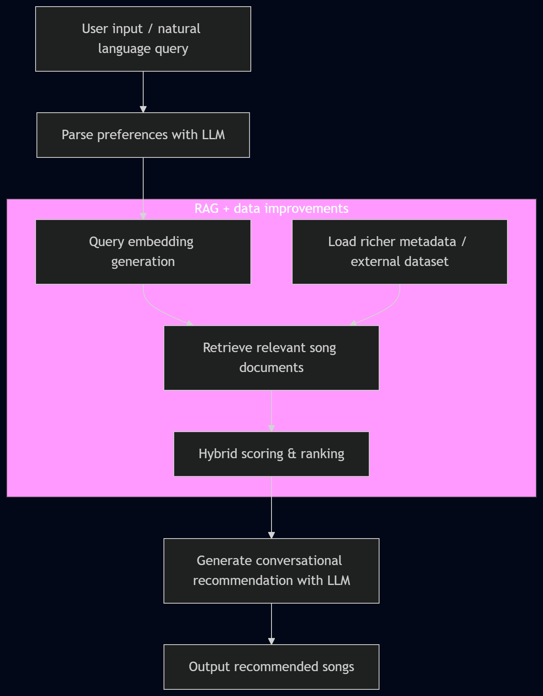

# 🎵 Beats Buddy 2.0 — RAG Music Recommender


## Project Title and Summary

**Beats Buddy 2.0** is an AI-powered music recommender that converts a user’s natural language mood request into ranked song suggestions from a catalog. It combines a lightweight retrieval pipeline with structured preference parsing and conversational response generation, so it feels like talking to a music-savvy assistant.

The original project was the **Modules 1-3 Music Recommender Simulation**. That version focused on representing songs and user taste profiles, building a scoring rule, and ranking candidates from a small dataset. This version extends that work by adding retrieval-aware ranking and query-driven preference interpretation.

## Demo Video
[![Beats Buddy 2.0 Demo]](https://www.loom.com/share/a89ce8d705a749c5b7c02d317aefd04a)

## Architecture Overview



The system has three main stages:

1. **User input** — user types a mood or listening request.
2. **Preference parsing** — an LLM turns the query into structured preferences like genre, mood, energy, and acoustic bias.
3. **Retrieval and ranking** — the recommender scores songs from `data/songs.csv`, ranks the top matches, and the LLM generates a human-friendly summary.

The diagram above shows the flow from text input to song retrieval and conversational output.

## Setup Instructions

### 1. Create a Python environment

```bash
python -m venv .venv
.venv\Scripts\activate
```

### 2. Install dependencies

```bash
pip install -r requirements.txt
```

### 3. Run the recommender

```bash
python -m src.main
```

Then type a natural language request such as `chill beats for studying`.

### 4. Run tests

```bash
pytest
```

## Sample Interactions

### Example 1

Input:

```text
I want calm, late-night music for studying.
```

Output:

```text
Top 5 Matches
  #1 …
  #2 …
  #3 …

Beats Buddy says...
  I found a few mellow tracks with relaxed energy and warm acoustic vibes that should help you focus.
```

### Example 2

Input:

```text
Give me upbeat pop with positive energy for a workout.
```

Output:

```text
Top 5 Matches
  #1 …
  #2 …
  #3 …

Beats Buddy says...
  These high-energy, happy pop songs are a great fit for a workout playlist.
```

### Example 3

Input:

```text
Need something dark and moody with a heavier sound.
```

Output:

```text
Top 5 Matches
  #1 …
  #2 …
  #3 …

Beats Buddy says...
  I selected intense, moody tracks with a darker feel that match your vibe.
```

## Design Decisions

- I kept the architecture simple with a clear separation between input parsing, retrieval, and output generation.
- The recommender uses a hybrid scoring scheme: semantic query matching plus weighted preference scoring for mood, energy, genre, acousticness, and valence.
- This design balances explainability and flexibility, while avoiding the complexity of full vector embeddings in this prototype.

Trade-offs:

- I chose a lightweight token-overlap retrieval method instead of embeddings to stay easy to run and inspect.
- The catalog is still small, so the model is best for proof of concept rather than large-scale production.
- The LLM is used for parsing and response text, but the actual ranking stays deterministic and traceable.

## Testing Summary

What worked:

- Natural language mood requests are successfully parsed into structured preferences.
- The recommender returns ranked song lists that reflect mood, energy, and acoustic preference.
- The legacy profile mode still works for preset STUDY, POP, and ROCK profiles.

What could be improved:

- The dataset is limited to the current CSV catalog.
- Retrieval can be stronger with embeddings or external music metadata.
- Tests currently verify logic, but more coverage could be added for LLM parsing failure paths.

What I learned:

- A simple recommender can still feel powerful when combined with an LLM for natural language understanding.
- Clear separation of concerns makes the pipeline easier to debug and extend.
- Small datasets highlight the importance of retrieval and candidate filtering.

## Reflection

This project taught me how practical AI systems are often built by combining several smaller layers rather than one giant model. The core lesson was that good user-facing AI is about reliable input interpretation, meaningful ranking, and clean output, not just clever algorithms.

Building this recommender also reinforced the value of trade-offs: you can get strong results quickly by choosing straightforward methods and keeping the system easy to understand.
